# Emergence Game Analysis

This repository features an unsupervised analysis of emergent game data (which can be viewed [here](https://github.com/J-Mo63/emergence-test-bed)), written in Python. It includes various tools for the pre-processing of game data and the generation of visualisations.

## Game Version 1 Visualisations

The first iteration of the experiment's codebase can be [viewed under the "v1" tag](https://github.com/J-Mo63/emergence-test-bed/releases/tag/v1), which is defined in the below visuals as test `base_v1`. Each other test is denoted by the format of `<feature_name>_<value_change>` so for instance, a test increasing player speed by 20 would be written as `player_speed_+20`. The animated heatmaps and histograms are only generated for `base_v1` and the correlation matrices include all test results.

### Game World Location Heatmaps

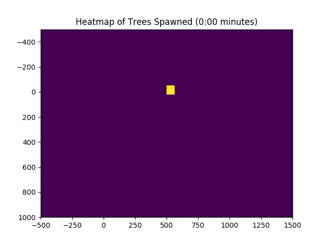 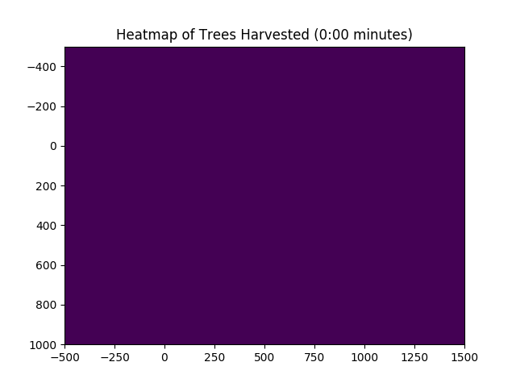 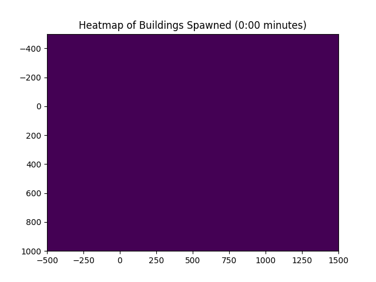

### Parameter Check Line Graphs

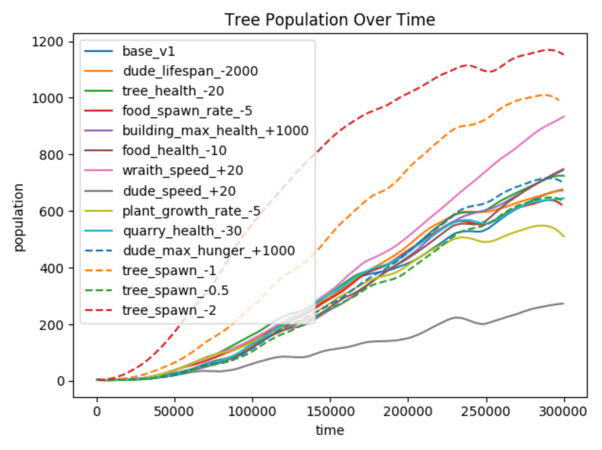 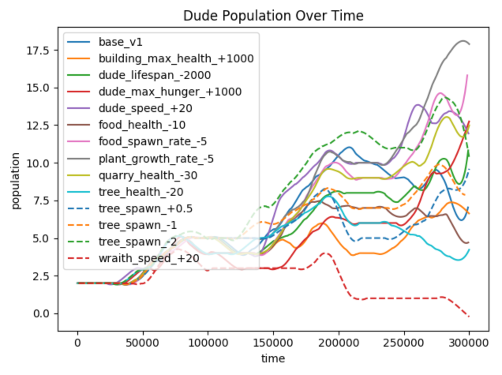 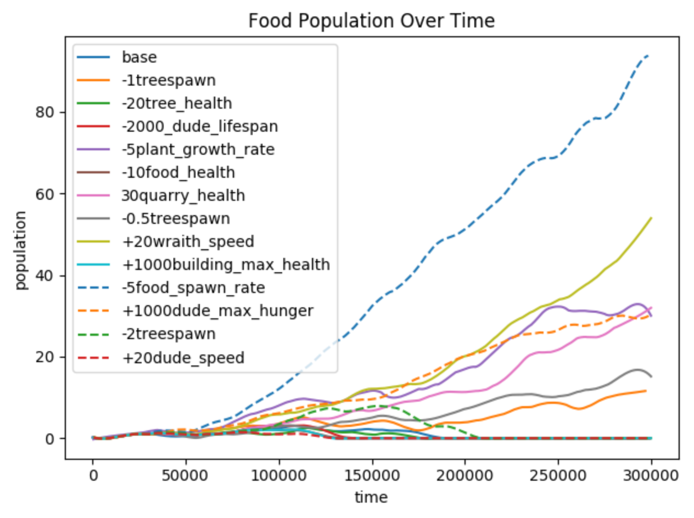 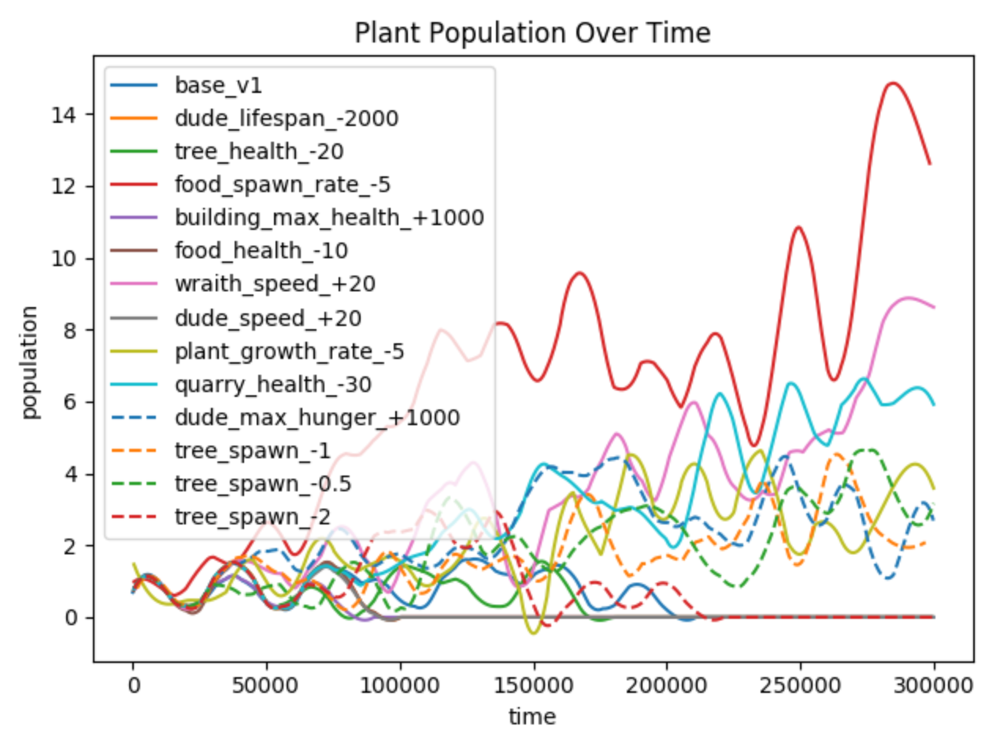 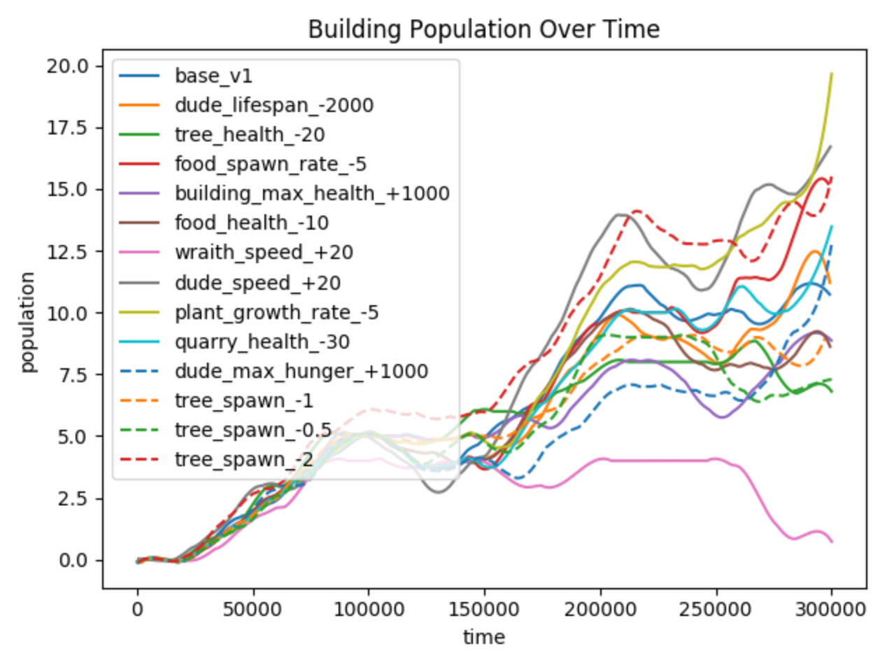

### Event Time Histograms

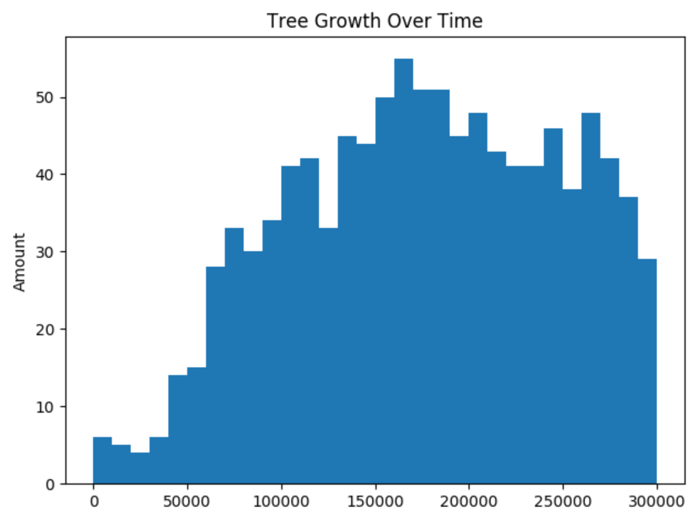 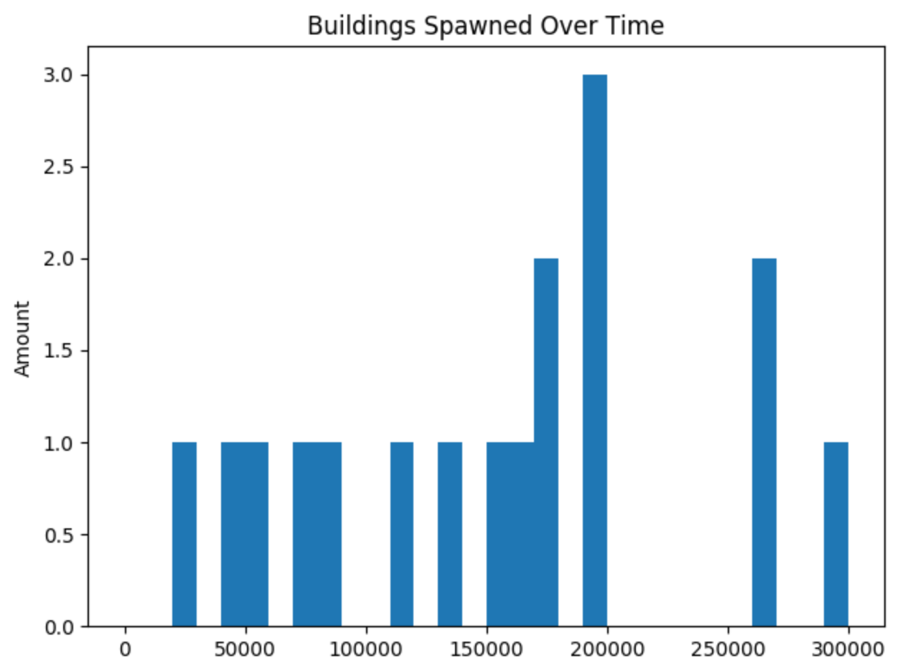 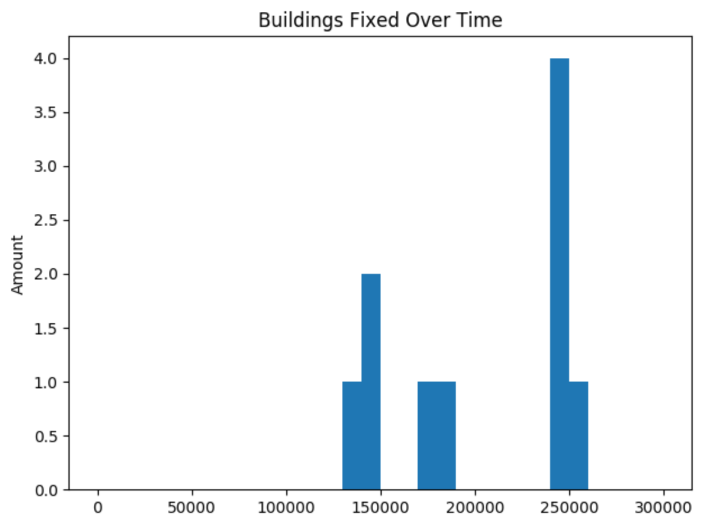

### Correlation Matrices

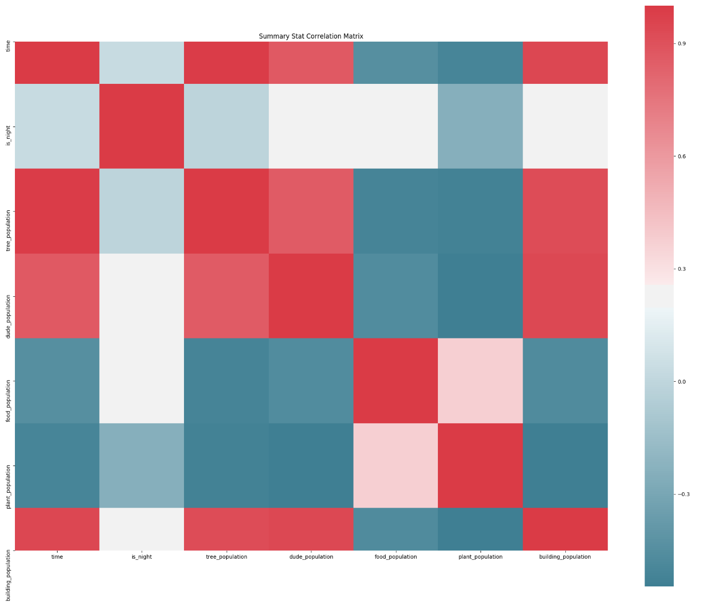 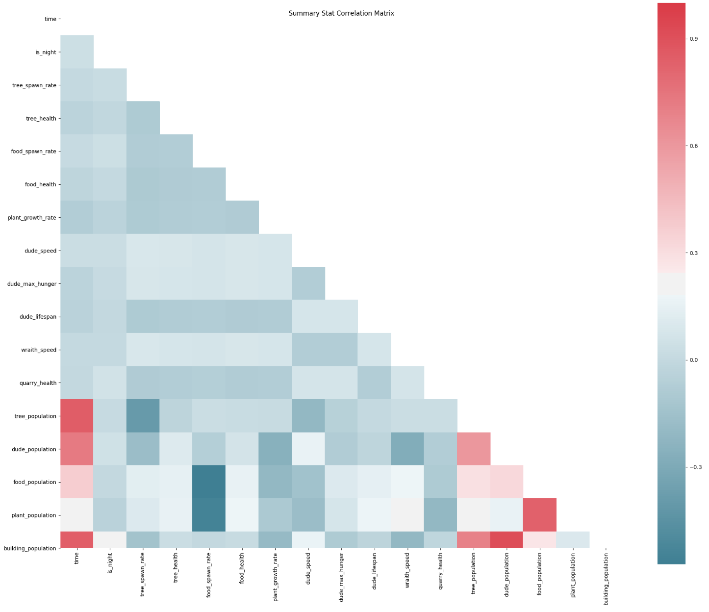