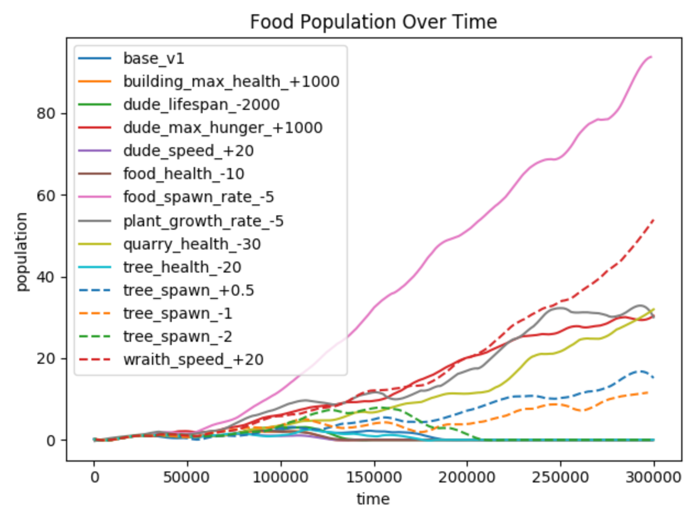
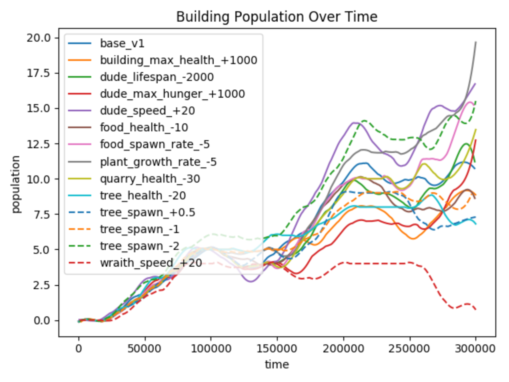

# Emergence Game Analysis

This repository features an unsupervised analysis of emergent game data (which can be viewed [here](github.com/J-Mo63/emergence-test-bed)), written in Python. It includes various tools for the pre-processing of game data and the generation of visualisations.

## Game Version 1 Visualisations

### Game World Location Heatmaps

### Event Time Histograms

### Parameter Check Line Graphs

### Correlation Matrices

