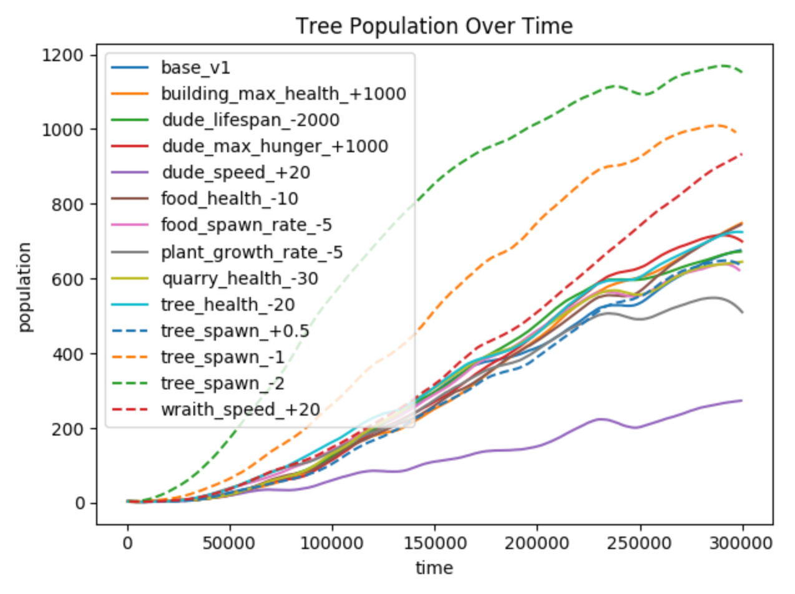
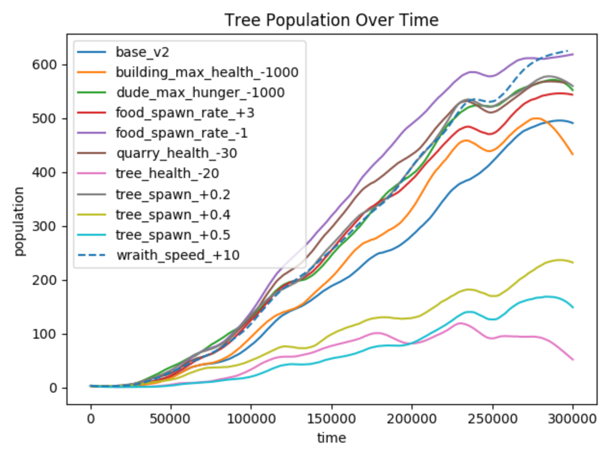
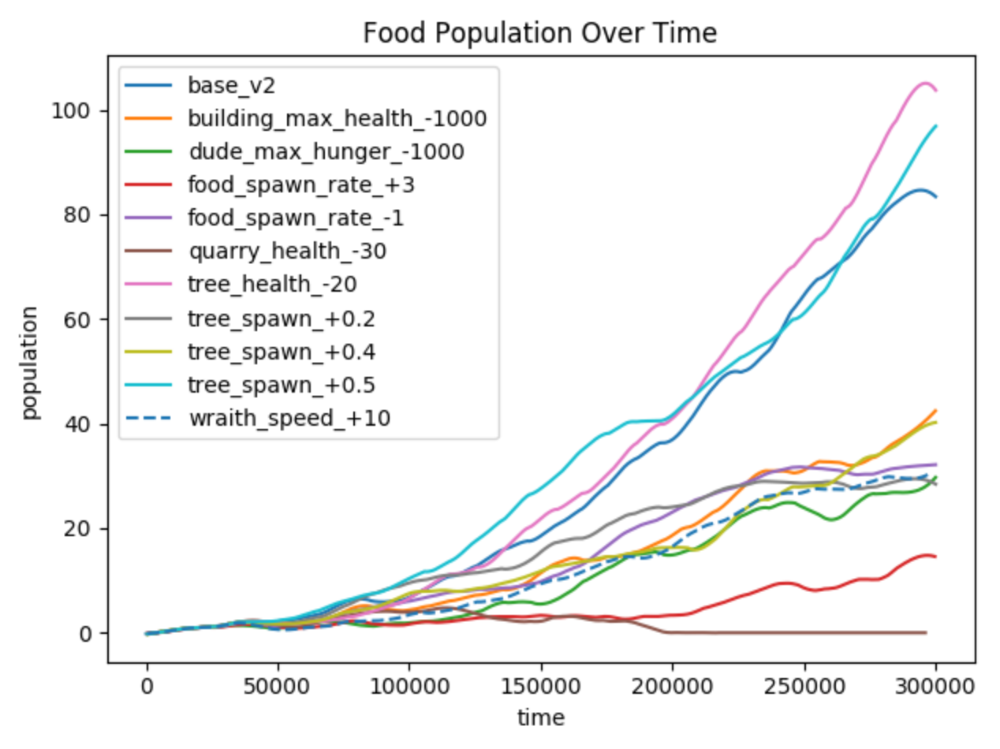
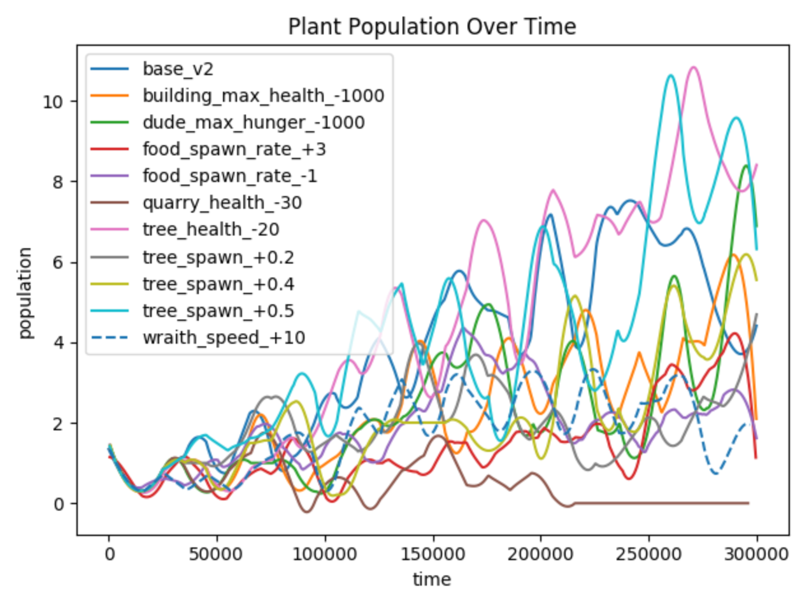
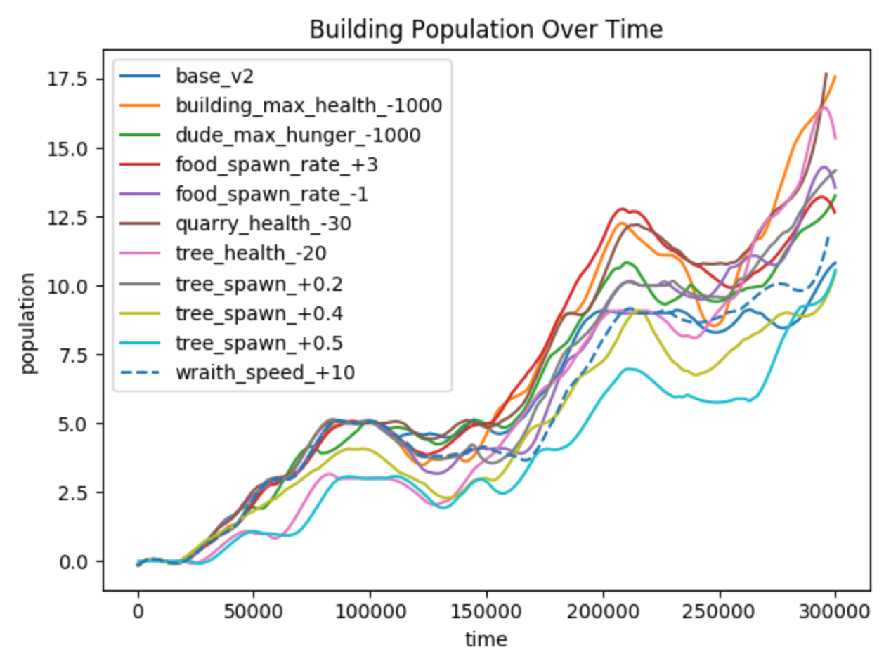

# Emergence Game Analysis

This repository features an unsupervised analysis of emergent game data (which can be viewed [here](https://github.com/jonjondev/emergence-test-bed)), written in Python. It includes various tools for the pre-processing of game data and the generation of visualisations.

## Game Version 1 Visualisations

The first iteration of the experiment's codebase can be [viewed under the "v1" tag](https://github.com/jonjondev/emergence-test-bed/releases/tag/v1), which is defined in the below visuals as test `base_v1`. Each other test is denoted by the format of `<feature_name>_<value_change>` so for instance, a test increasing player speed by 20 would be written as `player_speed_+20`. The animated heatmaps and histograms are only generated for `base_v1` and the correlation matrices include all test results.

### Game World Location Heatmaps

  

### Parameter Check Line Graphs

    

### Event Time Histograms

  

### Correlation Matrices

 

## Game Version 2 Visualisations

The second iteration of the experiment's codebase can be [viewed under the "v2" tag](https://github.com/jonjondev/emergence-test-bed/releases/tag/v2), which is defined in the below visuals as test `base_v2`. It utilises the combination of features from the tests:
- dude_speed_+20
- plant_growth_rate_-5

Using this information, the plant growth rate was reduced from 15 seconds by 5 seconds and the speed of dudes was increased by 10 (only half of the amount it was increased by in the test). This resulted in the **preservation of food and tree populations** as well as the **reduction of tree growth to under 500 instances**.

### Parameter Check Line Graphs (Previous Tests)

    

### Game World Location Heatmaps

   

### Parameter Check Line Graphs (New Tests)

    

## Game Version 3 Visualisations

The third iteration of the experiment's codebase can be [viewed under the "v3" tag](https://github.com/jonjondev/emergence-test-bed/releases/tag/v3), which is defined in the below visuals as test `base_v3`. It utilises the combination of features from the tests:
- tree_spawn_+0.4
- quarry_health_-30
- food_spawn_rate_-1

An issue identified in `base_v2` was that it created an overabundance of food. Using the information found, **this value was greatly reduced while preserving tree growth**.

### Parameter Check Line Graphs (Previous Tests)

    

### Game World Location Heatmaps

   

## Final Results

The final results for the analysis are shown below, highlighting all three base versions to illustrate the changes to the game's balance over time.

### Parameter Check Line Graphs of all Bases

    
